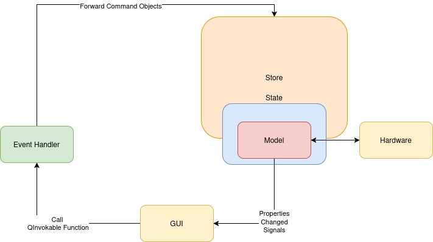
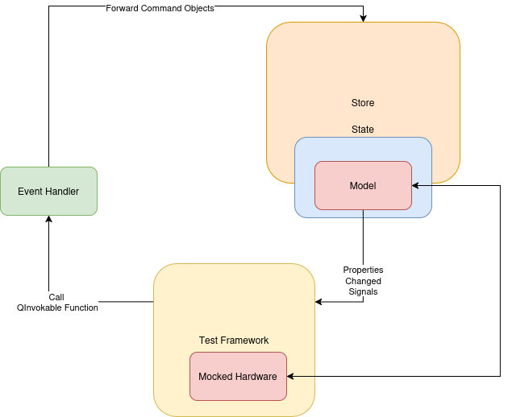

# Architecture Example for Qt

This repository contains an example application which
has a GUI, a connection to external hardware and some actions, which shall be executed
on this hardware or with the data comming from this hardware.

And for this use case, I have played around with different styles of architectures
and this approach here is based on [Redux](https://redux.js.org/tutorials/essentials/part-1-overview-concepts).

The Redux architecture looks like
[Redux Architecture](https://images.app.goo.gl/D4U3ZE5adXgpteqW6)

The architecture here, is slightly different.
This architecture does not update always the whole state, because this would destroy the data binding which is necessary for a working Qt application.
And because of the easyness of the application, the reducers are also not implemented.

# The Architecture in Productive Code

The **Eventhandler** and **State** are propagated into the QML Meta System.

When a User does an action this action calls an invokable function of the **Eventhandler**.
The **Eventhandler** dispatches this action into an QUndoCommand and gives this command
into the **Store**.

The **Store** executes the command.

The command executes the changes in the **State**.

The corresponding **Models** in the **State** changes the corresponding properties.

The **Changed-Signals** of the properties are forwarded into the **GUI**.

The **GUI** updates the displayed values based on the **Changed-Signals**.

The **Models** send the changed values to the **Hardware**.

# The Architecture for Testing

To test the whole application, the **Testing-Framework** mocks the **Hardware**.
Then the automated tests in the **Testing-Framework** call the invokable functions
of the **Eventhandler** and listens to the **Changed-Signals**.

